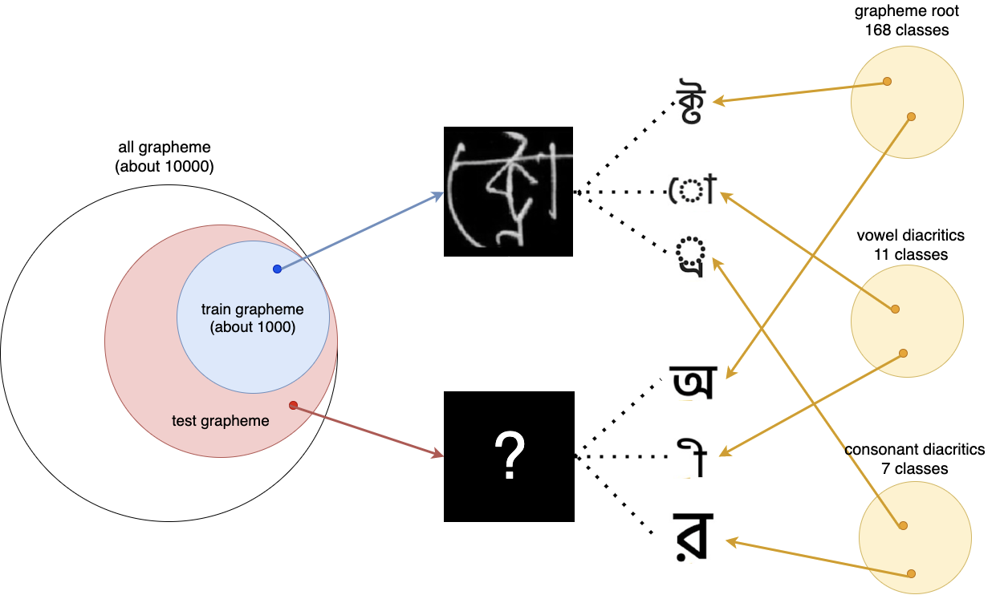

論文概要, competition solutionはnotionから移行してないので、そこはnotion見てください。 
コンペの取り組み方は後でちゃんと書きます。質問等はslackにて。

TODO
- [ ] segmentation
- [ ] detection
---
- [画像コンペに参加するまでにやったほうが良いこと](#practice)
- [コンペの取り組み方](#how_to)
- [コンペ中によく参照する論文等](#journal)
  - [pretrained model library](#pretrained_model_library)
  - [data augmentation library](#data_augmentation_library)
  - [classification models](#image_classification_models)
  - [reguralization](#reguralization)
  - [batch normalization](#batch_norm)
  - [hyperparameter tuning](#hyperparameter_tuning)
  - [imbalanced data](#imbalanced_data)
  - [semi-supervised learning](#semi_supervised_learning)
  - [unsupervised learning](#unsupervised_learning)
  - [multi task learning](#multi_task_learning)
  - [fine grained visual classification](#fine_grained_visual_classification)
  - [knowledge distillation](#knowledge_distillation)
  - [domain adaptation](#domain_adaptation)
  - [metric learning / face recognition / re-id](metric_learning)　
  - [survey](#survey)
  - [competition solution](#solution)
  - [tracking ML experiment](#ml_experiment)
  

# 画像コンペに参加するまでにやったほうが良いこと
画像コンペは特に難しいことは必要ないけど、下に書いたぐらいの基礎的な知識を勉強した方が良さそう。 
下に書いたのは私が初コンペまでにやったやつ。 

## 深層学習
深層学習の基本的な知識と実装力を身につける。 
実装力に関しては、faster rcnnをスクラッチで実装出来るか否かを個人的には目安としてる。

- [ゼロから作るDeep Learning ―Pythonで学ぶディープラーニングの理論と実装1~2](https://www.oreilly.co.jp/books/9784873117584/)
- [CS231](http://cs231n.stanford.edu/)
- [pytorch tutorial](https://pytorch.org/tutorials/)
- [機械学習スタートアップシリーズ　これならわかる深層学習入門](https://www.kspub.co.jp/book/detail/1538283.html)
- [Deep Learning book(Goodfellow)](https://www.deeplearningbook.org/)
- faster rcnn実装(下の記事とか参考に)
  - [Object Detection and Classification using R-CNNs](https://www.telesens.co/2018/03/11/object-detection-and-classification-using-r-cnns/)
  - [Guide to build Faster RCNN in PyTorch
](https://medium.com/@fractaldle/guide-to-build-faster-rcnn-in-pytorch-95b10c273439)
  - [Understanding Region of Interest — (RoI Align and RoI Warp)](https://towardsdatascience.com/understanding-region-of-interest-part-2-roi-align-and-roi-warp-f795196fc193)
  - [Faster R-CNNにおけるRPNの世界一分かりやすい解説
](https://medium.com/lsc-psd/faster-r-cnn%E3%81%AB%E3%81%8A%E3%81%91%E3%82%8Brpn%E3%81%AE%E4%B8%96%E7%95%8C%E4%B8%80%E5%88%86%E3%81%8B%E3%82%8A%E3%82%84%E3%81%99%E3%81%84%E8%A7%A3%E8%AA%AC-dfc0c293cb69)

[dive into deep learning](https://d2l.ai/)も良い(らしい)。[pytorch実装](https://github.com/dsgiitr/d2l-pytorch)もある。

## コンピュータビジョン
下4冊で雰囲気はわかる。少なくとも上３冊は読んだ方が良い。
- [画像認識 (機械学習プロフェッショナルシリーズ)](https://www.kspub.co.jp/book/detail/1529120.html)
- [ディジタル画像処理[改訂新版]](https://www.amazon.co.jp/%E3%83%87%E3%82%A3%E3%82%B8%E3%82%BF%E3%83%AB%E7%94%BB%E5%83%8F%E5%87%A6%E7%90%86-%E6%94%B9%E8%A8%82%E6%96%B0%E7%89%88-%E7%94%BB%E5%83%8F%E6%83%85%E5%A0%B1%E6%95%99%E8%82%B2%E6%8C%AF%E8%88%88%E5%8D%94%E4%BC%9A/dp/490347450X/ref=sr_1_14?__mk_ja_JP=%E3%82%AB%E3%82%BF%E3%82%AB%E3%83%8A&dchild=1&keywords=%E7%94%BB%E5%83%8F%E8%AA%8D%E8%AD%98&qid=1597677388&sr=8-14)
- [コンピュータビジョン ―広がる要素技術と応用―](https://www.kyoritsu-pub.co.jp/bookdetail/9784320123571)
- [コンピュータビジョン ―アルゴリズムと応用―](https://www.kyoritsu-pub.co.jp/bookdetail/9784320123281)

## 機械学習、統計学
PRMLが読めれば十分な気がする。機械学習の勉強を始める前にPRMLを読み終わっていたので、私は特に勉強していない。 
詳しい方の意見を参考に。 
- [統計学入門 (基礎統計学Ⅰ)](https://www.amazon.co.jp/%E7%B5%B1%E8%A8%88%E5%AD%A6%E5%85%A5%E9%96%80-%E5%9F%BA%E7%A4%8E%E7%B5%B1%E8%A8%88%E5%AD%A6%E2%85%A0-%E6%9D%B1%E4%BA%AC%E5%A4%A7%E5%AD%A6%E6%95%99%E9%A4%8A%E5%AD%A6%E9%83%A8%E7%B5%B1%E8%A8%88%E5%AD%A6%E6%95%99%E5%AE%A4/dp/4130420658/ref=as_li_ss_tl?__mk_ja_JP=%E3%82%AB%E3%82%BF%E3%82%AB%E3%83%8A&dchild=1&keywords=%E7%B5%B1%E8%A8%88%E5%AD%A6%E5%85%A5%E9%96%80&qid=1597380226&sr=8-1&linkCode=sl1&tag=ku2tafas-22&linkId=6d7a6ad4b5b6ac931dc67b572c668c3d&language=ja_JP)
- [言語処理のための機械学習入門](https://www.amazon.co.jp/%E8%A8%80%E8%AA%9E%E5%87%A6%E7%90%86%E3%81%AE%E3%81%9F%E3%82%81%E3%81%AE%E6%A9%9F%E6%A2%B0%E5%AD%A6%E7%BF%92%E5%85%A5%E9%96%80-%E8%87%AA%E7%84%B6%E8%A8%80%E8%AA%9E%E5%87%A6%E7%90%86%E3%82%B7%E3%83%AA%E3%83%BC%E3%82%BA-%E9%AB%98%E6%9D%91-%E5%A4%A7%E4%B9%9F/dp/4339027510/ref=as_li_ss_tl?__mk_ja_JP=%E3%82%AB%E3%82%BF%E3%82%AB%E3%83%8A&dchild=1&keywords=%E8%87%AA%E7%84%B6%E8%A8%80%E8%AA%9E%E5%87%A6%E7%90%86&qid=1597465725&sr=8-11&linkCode=sl1&tag=ku2tafas-22&linkId=abe2052a52071ed4bef28b616299e678&language=ja_JP)
- [はじめてのパターン認識](https://www.amazon.co.jp/%E3%81%AF%E3%81%98%E3%82%81%E3%81%A6%E3%81%AE%E3%83%91%E3%82%BF%E3%83%BC%E3%83%B3%E8%AA%8D%E8%AD%98-%E5%B9%B3%E4%BA%95-%E6%9C%89%E4%B8%89/dp/4627849710/ref=pd_vtp_14_15?_encoding=UTF8&pd_rd_i=4627849710&pd_rd_r=5692d8e5-51d3-4d92-9d16-9962e5d71688&pd_rd_w=5jngZ&pd_rd_wg=tjAat&pf_rd_p=318dbedd-8f6c-40ed-ac94-8f96d2ad45ac&pf_rd_r=NVJNMS3YPQF0V8XYDXHG&psc=1&refRID=NVJNMS3YPQF0V8XYDXHG)
- [PRML 上・下](https://www.amazon.co.jp/%E3%83%91%E3%82%BF%E3%83%BC%E3%83%B3%E8%AA%8D%E8%AD%98%E3%81%A8%E6%A9%9F%E6%A2%B0%E5%AD%A6%E7%BF%92-%E4%B8%8A-C-M-%E3%83%93%E3%82%B7%E3%83%A7%E3%83%83%E3%83%97/dp/4621061224)

# コンペの取り組み方
[Bengali.AI Handwritten Grapheme classification](https://www.kaggle.com/c/bengaliai-cv19/overview)を例に説明します。 
取り組みの流れだけ説明。込み入った話はコンペごとに話す予定。

この粒度で良いです？もっと具体的に書いたほうが良い？

## 1. 分からないことは`Discussion`で聞く 
コンペのデータや評価指標、ルールに関して分からないことがあれば`Discussion`にスレッドを立てて聞いてみましょう。汚い言葉を使わなければ怒られないと思います。積極的に質問してみましょう。英語が苦手な方はdeeplとか使えば何とかなります。

## 2. コンペのルールを理解する 
後から騒がないように、まずはルールを良く読みましょう。初コンペの方は全部読んだほうが良いですが、２回目からは主に見るべき項目は以下です。下のやつ以外は同じです(本当か？)。めんどくさいですが、ちゃんと読みましょう。
- `Team Limits`
- `Submission Limits`
- `Competition Timeline`
- `COMPETITION-SPECIFIC RULES`

## 3. コンペの概要、評価指標、提出方法を理解する 
`Overview`のページに`Description`, `Evaluation`, `Timeline`, `Prizes`, `Notebooks Requirements`がありますが、見るのは下３つです。
- `Description`: コンペ開催の背景、目的、データの概要等が書いてあります。データに関しては、`Data`のページに詳しく書いているので、そちらを読みましょう。
- `Evaluation`: 評価指標の説明と提出するファイルのフォーマットが書かれています。
- 'Notebooks Requirements': kernelで提出する場合はこの項目があります。submitする際のcpu/gpuの制限時間、インターネットアクセス可能かどうかなどが書かれています。提出の際にエラーが出て上手く行かない場合は、[このリンク先](https://www.kaggle.com/c/deepfake-detection-challenge/overview/getting-started)の`Tips for successful submissions`にエラーメッセージごとの対処法が書かれているので、参考にしてください。 
上記に記載されている内容をまとめていきます。
  - タスク: 手書きのベンガル文字を入力とし、文字の構成要素であるgrapheme root, vowel diacritics, consonant diacriticsの３つのラベルに分類する。
  - 評価指標: hierarchical macro-averaged recall(weighted average of macro-averaged recall)
    - weight: grapheme_root : consonant_diacritic : vowel_diacritic = 2 : 1 : 1
  - notebook requirements
    - cpu <= 9h
    - gpu <= 2h
    - no internet
    - external data is allowed
  
もっと詳細に書いてもいいですが、私はこの粒度で書いています。

## 4. データの理解 (EDA)
`Data`のページの内容、与えられたデータをもとにデータの内容を整理していきます。 
まず、`Data`のページの内容は以下になります。
- 手書き文字の種類は約10,000
- 訓練データには約1,000種類
- テストデータには訓練データに存在する文字と訓練データに含まれない文字がいくつかあるが、文字の構成要素は共通
- アノテーションの際には、性別、年齢、利き手などのメタデータも取得していたが、コンペでは配布されていない
- 文字の認識ではなく、構成要素の分類タスクとすることで、10,000種類の文字が訓練データになくてもベンガル語のOCRシステムが構築できる

データに関する説明はできるだけ図にまとめると理解しやすいです。実際にまとめたものが以下になります。 
train/testのデータの説明から、public test dataの大部分がtrainと同じ文字、private test dataの大部分が未知のベンガル文字の場合、対策をせずに進めるとshake downする可能性があります。 
データのページには重要な情報が多くあるので、早い段階からまとめてその後の検証に役立てましょう。

続いて、与えられたデータに関してですが、これは実際に参加者が公開しているNotebookを見たほうが理解しやすいです。 
今回のコンペだと、[こちら](https://www.kaggle.com/pestipeti/bengali-quick-eda)が分かりやすいです。
提供されたcsvファイルにはどういったカラムがあるのか、各カラムの値の分布や目的変数と各変数の相関や関係性を把握していきます。
EDAに関してはなれだと思うので、参加しているコンペのnotebookを参考にしたり、EDAの結果をもとに議論をしているtopicに参加して経験を積んでいくのが一番早いと思います。 

## 5. ベースラインモデルの作成
今後の試行錯誤をしていくためのベースラインを作成します。この段階ではできるだけシンプルにしておきましょう。 
画像コンペ初めての方はnotebookにあるものを参考にしても良いと思います。

私の場合だとこんな感じです。
- model: resnet18 encoder -> avg pool -> fc * 3(grapheme root, vowel diacritics, consonant diacritics)
- data augmentation: none
- optimizer: adam
- lr: 1e-3
- lr scheduler: none
- epoch: 50
- loss: binary cross entropy
- loss weight: equal

## 6. 仮説、検証
ベースラインモデルをEDAや過去コンペのソリューション、論文等の知見をもとに改良していきます。 
今回のコンペだとやることはこんな感じです。
- data preprocess: original / crop&resize
  - 画像ごとに文字の大きさがことなり、多くの画像では背景領域が多いため、文字領域だけcropしてresizeして入力するか、何もせずそのまま入力するか
- data augmentation
  - mixup, cutmix, autoaugment, etc...
- class imbalance
  - focal loss, class balanced loss, reduced focal loss, etc...
- test内の未知のベンガル文字の対策
  - metric learning, gan
上記はEDA, 論文調査、過去のソリューション調査、discussion内の参加者の意見などから自然と思いつきます。後は気合で頑張りましょう(適当

## 7.その他重要なこと(tips&tricks)
- pre-trainedモデルを用いた転移学習を行う際は、encoderをフリーズして全結合層をadam(lr:1e-3)で学習、3~5epochで解除、lr:1e-4で学習を再開する。いきなりモデル全体を訓練するとencoderの特徴抽出機能が崩壊する(らしい)。
- 学習率(1e-3, 1e-4)に関しては、私の場合は全タスクで固定し、コンペ終了まで変更しない。多少チューニングしても良いと思うが、あまり時間をかけすぎないこと。
- ensemble(averaging): 全体を単純に加重平均するのではなく、confusion matrixなどの情報をもとにcolumnごとに独立に行うほうが良い。
- cnn stacking: みんなやってるけど、誰も詳しく知らない謎の手法。[iMaterialist Challenge(Fashion)](https://www.kaggle.com/c/imaterialist-challenge-fashion-2018/discussion/57934)でKeepLearningが初めて使った。target labelの数が100以上などの場合はLightGBMでstackingするのは辛いが、これだと1モデルだけでいい。モデルの予測ごとの相関を学習するらしいが、stackする順番は精度に影響しないのでそんなことはない。batch_sizeが大きく影響するので、そこのチューニングは必要。
- data augmentation: augmentation後の画像が外れ値とならないように気をつける。ベンガル文字の反転はデータ分布が大きく変わるので、逆に精度が悪化するので注意。反転させて新しいlabel idを割り振ることが効果的な場合もあるので、よく考えて使うこと。
- 入力画像サイズは、識別に必要な特徴が潰れる場合があるので、コンペ序盤に解像度がどの程度影響するか調査しておくほうが良い。目視での確認は当てにならないのでやらないほうが良い。

- TODO　残りは追記します。

# コンペ中によく参照する論文等(コンペ後に更新)
TODO
- [ ] 論文概要

概要はどの粒度でこっちに書くか決めてない。とりあえずnotion見て

# pretrained models
- [pretrained-models.pytorch](https://github.com/Cadene/pretrained-models.pytorch)
- [pytorch-image-models](https://github.com/rwightman/pytorch-image-models)
- [EfficientNet-Pytorch](https://github.com/lukemelas/EfficientNet-PyTorch)

# data augmentation library
- [albumentations](https://github.com/albumentations-team/albumentations)
- [dali](https://github.com/NVIDIA/DALI)
- [kornia](https://github.com/kornia/kornia)
- [rising](https://github.com/PhoenixDL/rising)
- [solt](https://github.com/MIPT-Oulu/solt)

# classification models
## must
- [Inceptionv3](https://arxiv.org/abs/1512.00567) (CVPR'16)
- [ResNet](https://arxiv.org/abs/1512.03385) (CVPR'16)
- [DenseNet](https://arxiv.org/abs/1608.06993) (CVPR'17)
- [ResNeXt](https://arxiv.org/abs/1611.05431) (CVPR'17)
- [SENet](https://arxiv.org/abs/1709.01507) (CVPR'18)
- [coord conv](https://arxiv.org/abs/1807.03247) (NeurIPS'18)
- [HRNet](https://arxiv.org/abs/1908.07919) (CVPR'19)
- [EfficientNet](https://arxiv.org/abs/1905.11946) (ICML'19)
- [ECA-Net](https://arxiv.org/abs/1910.03151) (CVPR'20)
- [ResNeSt](https://arxiv.org/abs/2004.08955) (arxiv)
- [octave conv](https://arxiv.org/abs/1904.05049) (ICCV'19)

## try
- [HarDNet](https://arxiv.org/abs/1909.00948) (ICCV'19)
- [RegNet](https://arxiv.org/abs/2003.13678) (CVPR'20)
- [CSPNet](https://arxiv.org/abs/1911.11929) (CVPRW'20)
- [Spatially Attentive Output Layer](https://arxiv.org/abs/2004.07570) (CVPR'20)
- [Improved ResNet](https://arxiv.org/abs/2004.04989) (arxiv)
- [SlimConv](https://arxiv.org/abs/2003.07469) (arxiv)
- [Visual Transformers](https://arxiv.org/abs/2006.03677) (arxiv)
- [URIE](https://arxiv.org/abs/2007.08979) (ECCV'20)

# reguralization
## label smoothing
[When Does Label Smoothing Help?](https://arxiv.org/abs/1906.02629) (NeurIPS'19)

## dropout
- [dropout](https://jmlr.org/papers/v15/srivastava14a.html) (JMLR'14)
- [dropblock](https://arxiv.org/abs/1810.12890) (NeurIPS'18)

## data augmentatoin
### model robustness under data shift
- [Generalisation in humans and deep neural networks](https://arxiv.org/abs/1808.08750) (NeurIPS'18)
- [IMAGENET-TRAINED CNNS ARE BIASED TOWARDS TEXTURE](https://arxiv.org/abs/1811.12231) (ICLR'19)
- [BENCHMARKING NEURAL NETWORK ROBUSTNESS TO COMMON CORRUPTIONS AND PERTURBATIONS](https://arxiv.org/abs/1903.12261) (ICLR'19)
- [Why do deep convolutional networks generalize so poorly to small image transformations?](https://arxiv.org/abs/1805.12177) (JMLR'19)

### augmentation method
- [mixup](https://arxiv.org/abs/1710.09412) (ICLR'18)
- [CutMix](https://arxiv.org/abs/1905.04899) (ICCV'19)
- [Manifold Mixup](https://arxiv.org/abs/1806.05236) (ICML'19)
- [Fast AutoAugment](https://arxiv.org/abs/1905.00397) (NeurIPS'19)
- [Implicit Semantic Data Augmentation](https://arxiv.org/abs/1909.12220) (NeurIPS'19)
- [Population Based Augmentation](https://arxiv.org/abs/1905.05393) (ICML'19)
- [RandAugment](https://arxiv.org/abs/1909.13719) (CVPRW'20)
- [SmoothMix](https://openaccess.thecvf.com/content_CVPRW_2020/papers/w45/Lee_SmoothMix_A_Simple_Yet_Effective_Data_Augmentation_to_Train_Robust_CVPRW_2020_paper.pdf) (CVPRW'20)
- [Adversarial AutoAugment](https://arxiv.org/abs/1912.11188) (ICLR'20)
- [AUGMIX](https://arxiv.org/abs/1912.02781) (ICLR'20)
- [Puzzle Mix](https://proceedings.icml.cc/static/paper_files/icml/2020/6618-Paper.pdf) (ICML'20)
- [Attribute Mix](https://arxiv.org/abs/2004.02684) (arxiv)
- [Attentive CutMix](https://arxiv.org/abs/2003.13048) (arxiv)
- [FMix](https://arxiv.org/abs/2002.12047) (arxiv)
- [Momentum Exchenge](https://arxiv.org/abs/2002.11102) (arxiv)
- [patch gaussian](https://arxiv.org/abs/1906.02611) (arxiv)

# batch normalization
- [Instance Normalization](https://arxiv.org/abs/1701.02096) (CVPR'17)
- [Group Normalization](https://arxiv.org/abs/1803.08494) (ECCV'18)
- [Filter Response Normalization](https://arxiv.org/abs/1911.09737) (CVPR'20)
- [Evolving Normalization](https://arxiv.org/abs/2004.02967) (arxiv)

# hyperparameter tuning
## library
- [optuna](https://optuna.org/)
## journal
- [RETHINKING THE HYPERPARAMETERS
FOR FINE-TUNING](https://arxiv.org/abs/2002.11770) (ICLR'20)
- [HyperSTAR](https://arxiv.org/abs/2005.10524) (CVPR'20)

# imbalanced data
- [pc-softmax](https://arxiv.org/abs/1911.10688) (arxiv)
- [focal loss](https://arxiv.org/abs/1708.02002) (ICCV'17)
- [reduced focal loss](https://arxiv.org/abs/1903.01347) (arxiv)
- [Class-Balanced Loss](https://arxiv.org/abs/1901.05555) (CVPR'19)
- [Bilateral-Branch Network](https://arxiv.org/abs/1912.02413) (CVPR'20)
- [Rebalanced mixup](https://arxiv.org/abs/2007.03943) (arxiv)
- [M2m](https://arxiv.org/abs/2004.00431) (CVPR'20)

# semi-supervised learning
- [Pseudo-label](http://deeplearning.net/wp-content/uploads/2013/03/pseudo_label_final.pdf)
- [Noisy Student](https://arxiv.org/abs/1911.04252) (CVPR'20)
- [Mean Teacher](https://arxiv.org/abs/1703.01780) (NIPS'17)
- [MixMatch](https://arxiv.org/abs/1905.02249) (NIPS'19)
- [FixMatch](https://arxiv.org/abs/2001.07685) (arxiv)
- [FeatMatch](https://arxiv.org/abs/2007.08505) (ECCV'20)

# unsupervised learning
- [SCAN](https://arxiv.org/abs/2005.12320) (ECCV'20)

# multi task learning
- [Dynamic Weight Average](https://arxiv.org/abs/1803.10704) (CVPR'19)
- [NDDR-CNN](https://arxiv.org/abs/1801.08297) (CVPR'19)
- [ML-GCN](https://arxiv.org/abs/1904.03582) (CVPR'19)

# fine grained visual classification
- [Facing the Hard Problems in FGVC](https://arxiv.org/abs/2006.13190) (arxiv)
- [DFL-CNN](https://openaccess.thecvf.com/content_cvpr_2018/papers/Wang_Learning_a_Discriminative_CVPR_2018_paper.pdf) (CVPR'18)
- [Destruction and Construction Learning](https://openaccess.thecvf.com/content_CVPR_2019/papers/Chen_Destruction_and_Construction_Learning_for_Fine-Grained_Image_Recognition_CVPR_2019_paper.pdf) (CVPR'19)
- [Look-Into-Object](https://openaccess.thecvf.com/content_CVPR_2020/papers/Zhou_Look-Into-Object_Self-Supervised_Structure_Modeling_for_Object_Recognition_CVPR_2020_paper.pdf) (CVPR'20)

# knowledge distillation
- [Learning What and Where to Transfer](https://arxiv.org/abs/1905.05901) (ICML'19)
- [Relational Knowledge Distillation](https://arxiv.org/abs/1904.05068) (CVPR'19)
- [Attention Transfer](https://arxiv.org/abs/1612.03928) (ICLR'17)
- [Noisy Student](https://arxiv.org/abs/1911.04252) (CVPR'20)
- [Mean Teacher](https://arxiv.org/abs/1703.01780) (NIPS'17)

# domain adaptation
- [domain adversarial neural network](https://arxiv.org/abs/1505.07818) (JMLR'16)
- [REVISITING BATCH NORMALIZATION FOR PRACTICAL DOMAIN ADAPTATION](https://arxiv.org/abs/1603.04779) (ICLR'17)
- [MUNIT](https://arxiv.org/abs/1804.04732) (ECCV'18)
- [Style Normalization and Restitution](https://arxiv.org/abs/2005.11037) (CVPR'20)

# metric learning / face recognition / re-id
## library
- [torch reid](https://github.com/KaiyangZhou/deep-person-reid)
- [insightface](https://github.com/deepinsight/insightface)
- [reid-strong-baseline](https://github.com/michuanhaohao/reid-strong-baseline)
- [cnnimageretrieval-pytorch](https://github.com/filipradenovic/cnnimageretrieval-pytorch)

## journal
- [center loss](https://ydwen.github.io/papers/WenECCV16.pdf) (ECCV'16)
- [Fine-tuning CNN Image Retrieval with No Human Annotation](https://arxiv.org/abs/1711.02512) (TPAMI'18)
- [arcface](https://arxiv.org/abs/1801.07698) (CVPR'19)
- [AdaCos](https://arxiv.org/abs/1905.00292) (CVPR'19)
- [MS-Loss](http://openaccess.thecvf.com/content_CVPR_2019/papers/Wang_Multi-Similarity_Loss_With_General_Pair_Weighting_for_Deep_Metric_Learning_CVPR_2019_paper.pdf) (CVPR'19)
- [Bag of Tricks and A Strong Baseline for Deep Person Re-identification](https://arxiv.org/abs/1903.07071) (CVPRW'19)
- [AP-Loss](https://arxiv.org/abs/1906.07589) (ICCV'19)
- [SoftTriple Loss](https://arxiv.org/abs/1909.05235) (ICCV'19)
- [Circle Loss](https://openaccess.thecvf.com/content_CVPR_2020/papers/Sun_Circle_Loss_A_Unified_Perspective_of_Pair_Similarity_Optimization_CVPR_2020_paper.pdf) (CVPR'20)
- [Cross-Batch Memory](https://arxiv.org/abs/1912.06798) (CVPR'20)
- [Unifying Deep Local and Global Features for Image Search](https://arxiv.org/abs/2001.05027) (ECCV'20)

# survey
- [Noisy Labels](https://arxiv.org/abs/2007.08199)
- [data augmentation](https://link.springer.com/article/10.1186/s40537-019-0197-0)
- [face recognition](https://arxiv.org/abs/1804.06655)
- [metric learning](https://www.mdpi.com/2073-8994/11/9/1066)

# competition solution
TODO
- [ ] コンペ追加
- [ ] コンペ概要
- [ ] solution概要

めんどくさい。これもとりあえずnotionで。

## Lightweight Face Recognition Challenge(ICCV'19)
- [1st place](https://arxiv.org/abs/1909.00632)
  - ArcNegFace: utilize hard negative mining and suppress error label
  - Poly Face: searched network considering flops constraint 
  - Bag of tricks for metric learning

# Managing ML Experiments
- [comparison of the features of experiment management tools](https://neptune.ai/blog/best-ml-experiment-tracking-tools)
- [wandb](https://www.wandb.com/)
- [Comet](https://www.comet.ml/site/)
