# semantic segmentaiton

- [Major papers](#major_papers)
  - [2015](#2015)
    - [FCN](#fcn) (CVPR'15)
    - [Hypercolumns](#hypercolumns) (CVPR'15)
    - [DeonvNet](#deconvnet) (ICCV'15)
    - [segnet](#segnet) (arxiv'15)
    - [DeepLab](#deeplab) (ICLR'15)
    - [U-Net](#unet) (MICCAI'15)
  - [2016](#2016)
    - [Attention_to_Scale](#attention_to_scale) (CVPR'16)
    - [parsenet](#parsenet) (arxiv'16)
    - [DeepLabv2](#deeplabv2) (arxiv'16)
  - [2017](#2017)
    - [GCN](#gcn) (CVPR'17)
    - [PSPNet](#pspnet) (CVPR'17)
    - [RefineNet](#refinenet) (CVPR'17)
    - [DeepLabv3](#deeplabv3) (arxiv'17)
  - [2018](#2018)
    - [EncNet](#encnet) (CVPR'18)
    - [DenseASPP](#denseaspp) (CVPR'18)
    - [OCNet](#ocnet) (arxiv'18)
    - [PSANet](#psanet) (ECCV'18)
    - [DeepLabv3+](#deeplabv3+) (ECCV'18)
    - [ExFuse](#exfuse) (ECCV'18)
    - [PANet](#panet) (BMVC'18)
    - [SCSE](#scse) (MICCAI'18)
    - [attention unet](#attention_unet) (MIDL'18)
  - [2019](#2019)
    - [Decoders Matter for Semantic Segmentation](#decoder_matters) (CVPR'19)
    - [HRNet](#hrnet) (TPAMI'19)
    - [DANet](#danet) (CVPR'19)
    - [auto-DeepLab](#auto_deeplab) (CVPR'19)
    - [Co-occurrent Features](#co_occurrent) (CVPR'19)
    - [assymetric nonlocal NN](#assymetrci_nonlocal_nn) (ICCV'19)
    - [EMANet](#emanet) (ICCV'19)
    - [gated scnn](#gated_scnn) (ICCV'19)
    - [FastFCN](#fastfcn) (arxiv'19)
    - [convCRF](#convcrf) (BMVC'19)
  - [2020](#2020)
    - [Height-driven Attention](#height_driven_attention) (CVPR'20)
    - [dynamic routing](#dynamic_routing) (CVPR'20)
    - [cascade PSP](#cascade_psp) (CVPR'20)
    - [pointrend](#pointrend) (CVPR'20)
    - [SANet](#SANet) (CVPR'20)
    - [context prior](#context_prior) (CVPR'20)
    - [context adaptive convolution](#context_adaptive_convolution) (ECCV'20)
    - [OCR](#ocr) (ECCV'20)
    - [SegFix](#segfix) (ECCV'20)
    - [Semantic Flow](#semantic_flow) (ECCV'20)
    - [Hierarchical Multi-Scale Attention](#hierachical_multi_scale_attention) (arxiv'20)
    - [Rethinking Pre-training and Self-training](#rethinking_pre_training) (arxiv'20)
    
- [real time semantic segmentation model](#real_time)
  - [ESPNet](#espnet) (ECCV'18)  
  - [ICNet](#icnet) (ECCV'18)
  - [ContextNet](#contextnet) (BMVC'18)
  - [Semantic Flow](#semantic_flow) (ECCV'20)
  - [FASTERSEG](#fasterseg) (ICLR'20)

- [loss function](#loss_function)
  - [Binary_Cross Entropy](#binary_cross_entropy) 
  - [Weighted Cross Entropy](#weighted_cross_entropy)
  - [Focal Loss](#focal_loss)
  - [Dice Loss](#dice_loss)
  - [Combo Loss](#combo_loss)
  - [lovasz hinge](#lovasz_hinge)

- [competition overview / top solution](#competition)

- [how to win segmentation competition](#how_to_win_segmentation_competition)

# major papers

## 2015

### [Fully Convolutional Networks for Semantic Segmentation](https://arxiv.org/abs/1411.4038) (CVPR'15)
#### <strong>overview</strong>
***
- FCN transfer classification model by substituting fully connected layrs with 1x1 convolution
- As the model produces coarse output locations(conv7 output), output feature-map is upsampled 32x by bilinear interpolation(FCN-32s). 
- But this up-sampled feature-map is not enough for finegrained segmentation, so the authors use skip connection to combine conv7 output and lower layers output(conv4, conv3 output). 
- FCN-8s give the best result in PASCAL VOC 2011 & 2012 test data.
#### <strong>issue</strong>
***
- FCN use skip connections for finegrained segmentation, but it is not enough to represent detail information, especially object boudary.
- Detail information is usually missing due to the use of the down-sampling layers

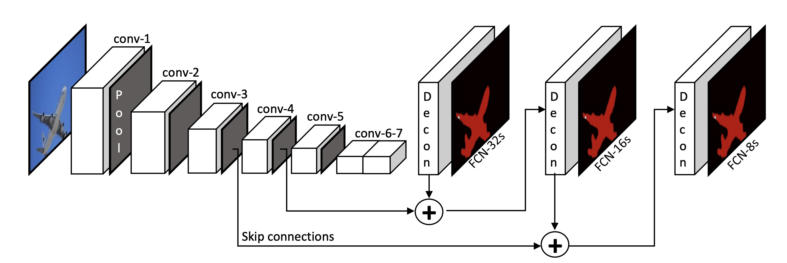 

### [Hypercolumns for Object Segmentation and Fine-grained Localization](https://arxiv.org/abs/1411.5752)  (CVPR'15)
#### <strong>overview</strong>
- Hypercolumn stack deep and shallow layer output of CNN into one vector
- Deep layer capture semantics, while shallow layer is precise in localization
- So we can do more precise segmentation by using Hypercolumn
- it improves SDS from 49.7 to 52.8 mean APr
***
#### <strong>issue</strong>
***
- same as FCN

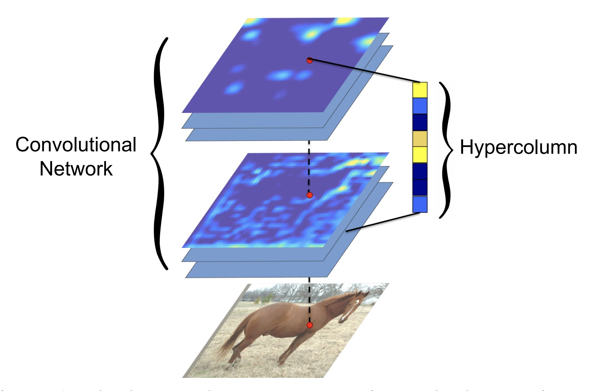　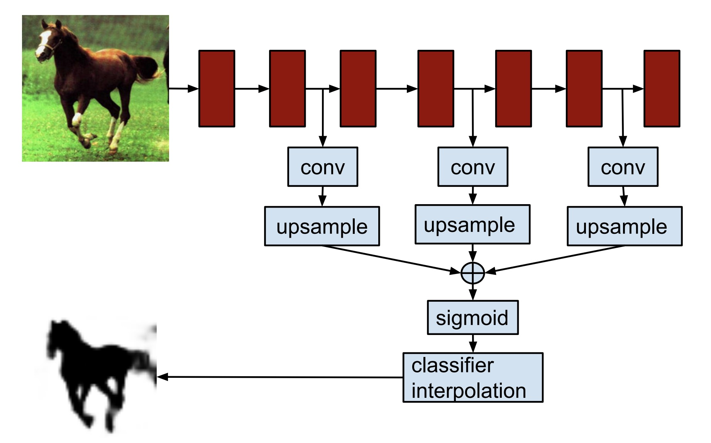

### [Learning Deconvolution Network for Semantic Segmentation (DeconvNet)](https://arxiv.org/abs/1505.04366) (ICCV'15)
#### <strong>overview</strong>
***
- Convolutional network followed by hierarchically opposite deconvolutional network
- Convolutional network composed of 13 convolutional layers and 2 fully connected layers of VGG16 except the final classification layer
- Deconvolutional network is composed of deconvolution and unpooling layers
- Unpooling use max_pooling indices which is the locations of maximum activations during pooling operation in convolutional network. it can reconstruct detail image information.
- Deconvolution densify sparse unpooled feature maps using multiple learned filters by associating single input activation with multiple outputs
- Unlike FCN, trained model is applied to each proposal in an input image, and construct the final segmentation result by combining the result from all proposals
- mean IoU is 72.5% in PASCAL VOC 2012, it is superior than FCN-8s(62.2%)
- As a result, deconvolutional network can reconstruct detail information
#### <strong>issue</strong>
***
- Model is huge and slow
- Using max_pooling indices is not enough to reconstruct detail information

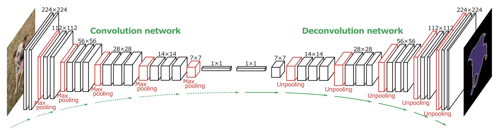

### [SegNet: A Deep Convolutional Encoder-Decoder Architecture for Image Segmentation](https://arxiv.org/abs/1511.00561) (arxiv'15)
#### <strong>overview</strong>
***
- Most of the model architecture is same as DeconvNet
- Difference of DeconvNet is removing 2 fully connected layers, which decrease model size from 134M to 14.7M
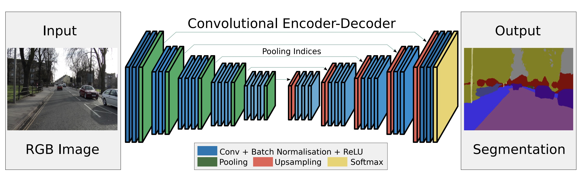

### [SEMANTIC IMAGE SEGMENTATION WITH DEEP CONVOLUTIONAL NETS AND FULLY CONNECTED CRFS(DeepLab)](https://arxiv.org/abs/1412.7062) (ICLR'15)
#### <strong>overview</strong>
***
- This paper propose atrous convolution which sparsely sample feature map
- Architecture of DeepLab is VGG16 removing pool4 and pool5, which can keep high resolution, but recdptive field is reduced
- By substituting some last convolutions by atrous convolution, DeepLab can keep receptive field
- Use CRF to capture fine details for postprocess
- Use multi scale prediction for better boudary localization
#### <strong>issue</strong>
***
- By removing pool4 and pool5, feature map keep high resolution
- it increase computational cost

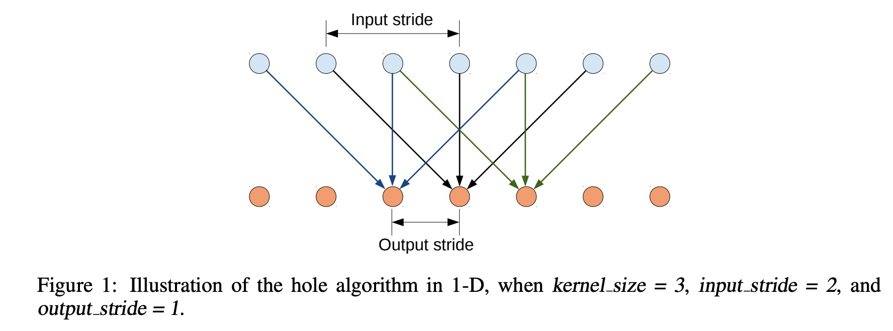 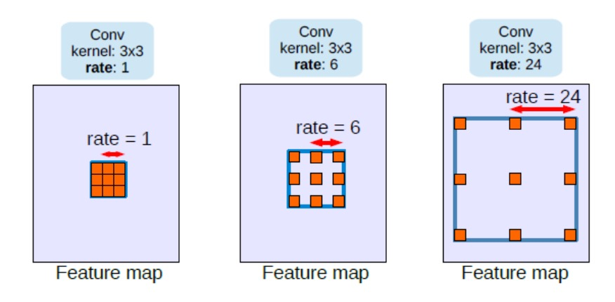

### [U-Net: Convolutional Networks for Biomedical Image Segmentation](https://arxiv.org/abs/1505.04597) (MICCAI'15)
#### <strong>overview</strong>
***
- Use encoder featuremap in decoder network
- Decoder network concatenate output of deep layer and corresponding output of shallow layer
- It can use more precise information compared to segnet and deconvnet

 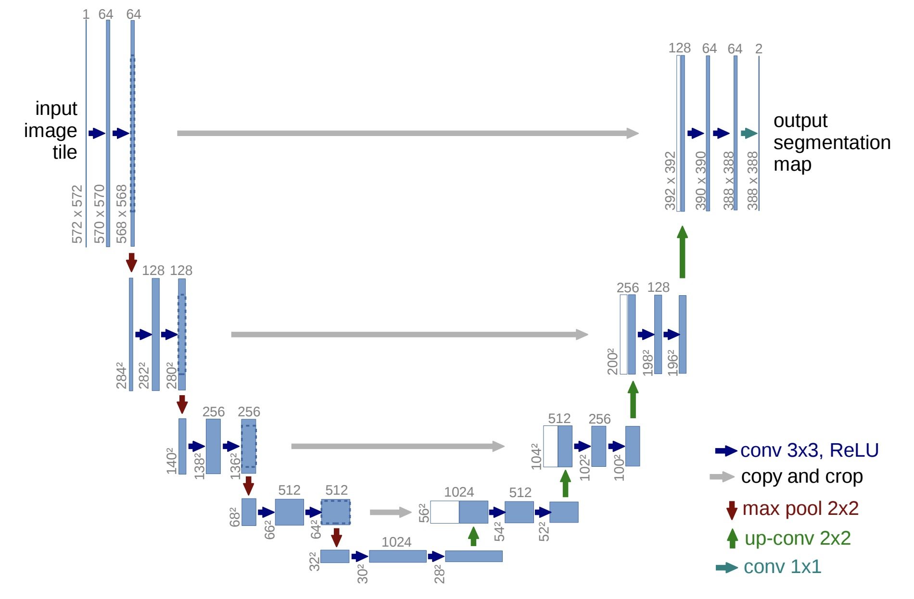 

## 2016

### [Attention to Scale: Scale-aware Semantic Image Segmentation](https://arxiv.org/abs/1511.03339) (CVPR'16)
#### <strong>overview</strong>
***
#### <strong>issue</strong>
***

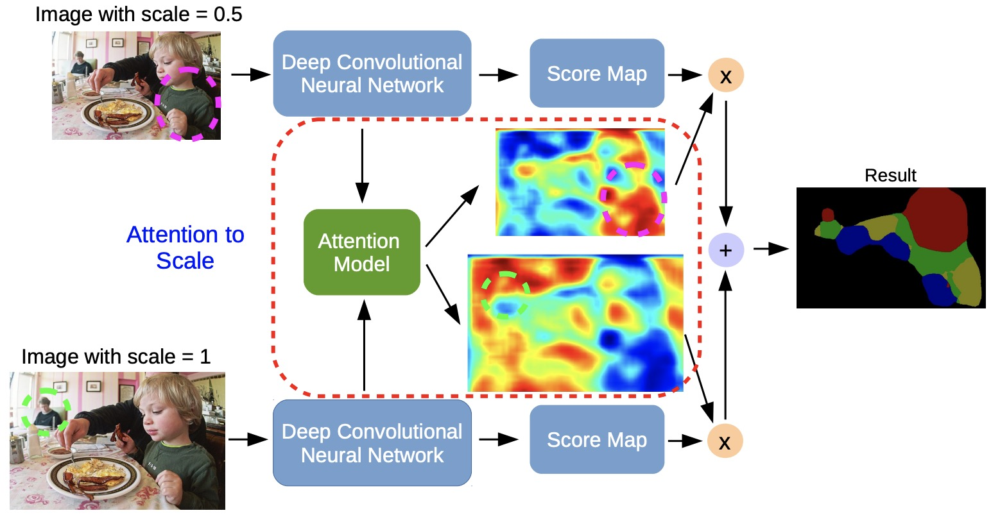

### [ParseNet: Looking Wider to See Better](https://arxiv.org/abs/1506.04579) (arxiv'16)
#### <strong>overview</strong>
***
#### <strong>issue</strong>
***

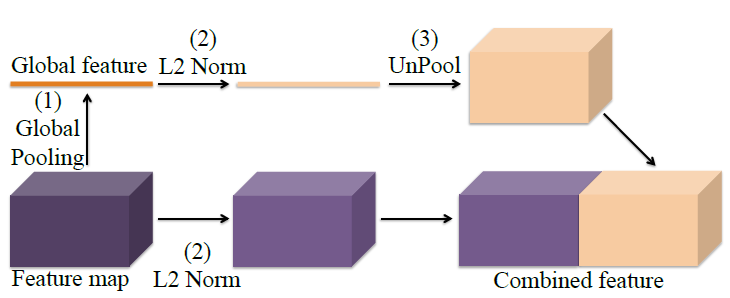

### [DeepLab: Semantic Image Segmentation with Deep Convolutional Nets, Atrous Convolution, and Fully Connected CRFs(DeepLabv2)](https://arxiv.org/abs/1606.00915) (arxiv'16)
#### <strong>overview</strong>
***
#### <strong>issue</strong>
***

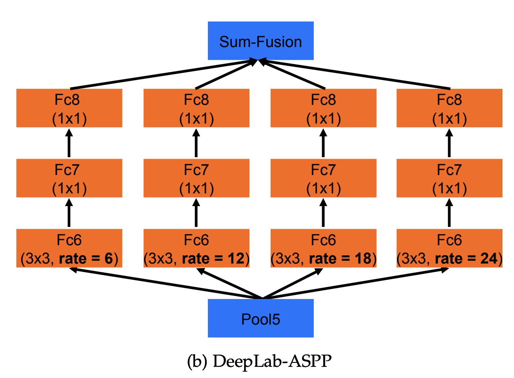

## 2017

### [Large Kernel Matters: Improve Semantic Segmentation by Global Convolutional Network(GCN)](https://openaccess.thecvf.com/content_cvpr_2017/papers/Peng_Large_Kernel_Matters_CVPR_2017_paper.pdf) (CVPR'17)
#### <strong>overview</strong>
***
#### <strong>issue</strong>
***

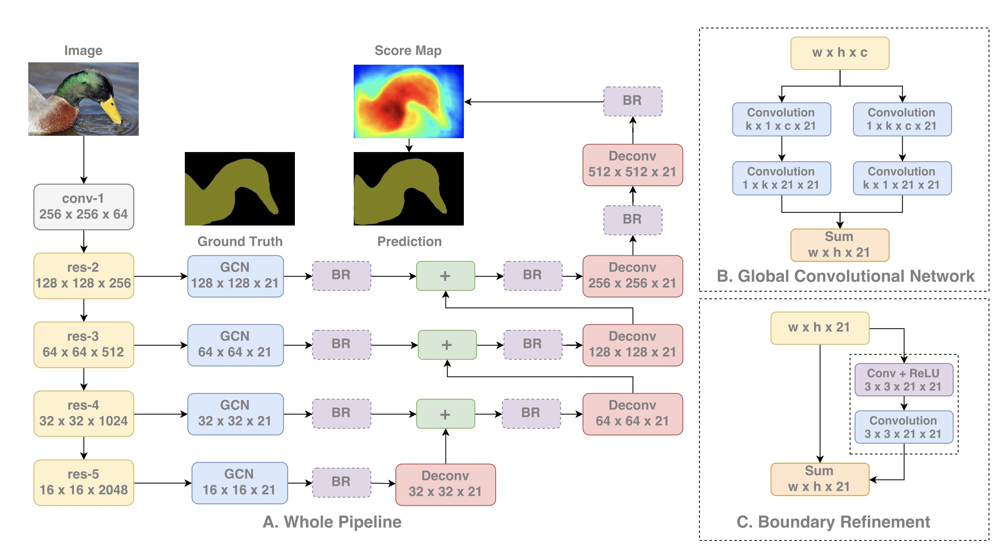

### [Pyramid Scene Parsing Network(PSPNet)](https://openaccess.thecvf.com/content_cvpr_2017/papers/Zhao_Pyramid_Scene_Parsing_CVPR_2017_paper.pdf) (CVPR'17)
#### <strong>overview</strong>
***
#### <strong>issue</strong>
***
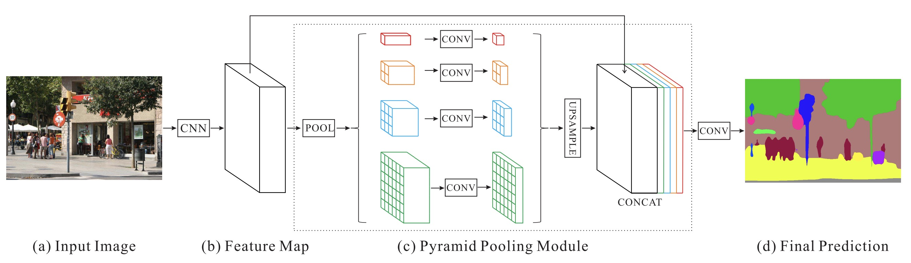

### [RefineNet: Multi-Path Refinement Networks for High-Resolution Semantic Segmentation](https://openaccess.thecvf.com/content_cvpr_2017/papers/Lin_RefineNet_Multi-Path_Refinement_CVPR_2017_paper.pdf) (CVPR'17)
#### <strong>overview</strong>
***
#### <strong>issue</strong>
***
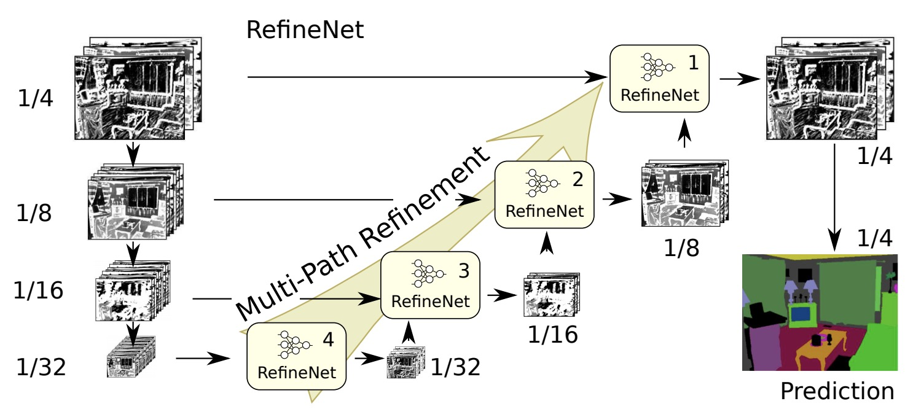 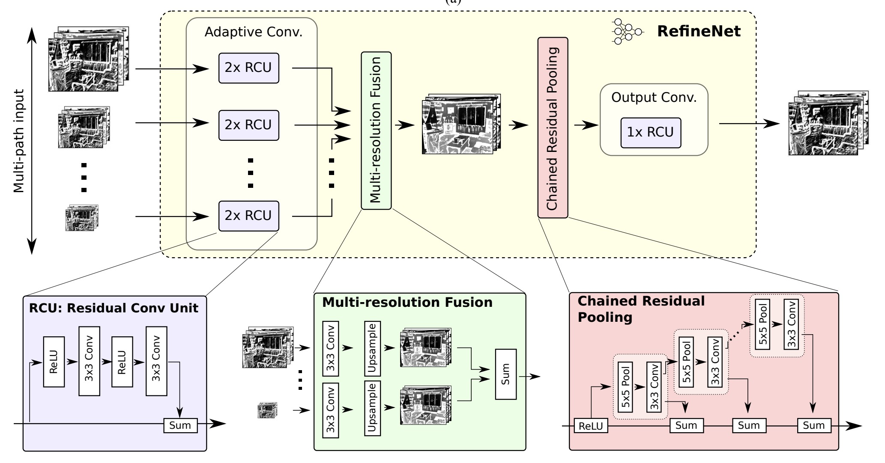 

### [Rethinking Atrous Convolution for Semantic Image Segmentation](https://arxiv.org/abs/1706.05587) (arxiv'17)
#### <strong>overview</strong>
***
#### <strong>issue</strong>
***

## 2018

### [Context Encoding for Semantic Segmentation(EncoderNet)](https://openaccess.thecvf.com/content_cvpr_2018/papers/Zhang_Context_Encoding_for_CVPR_2018_paper.pdf) (CVPR'18)
#### <strong>overview</strong>
***
#### <strong>issue</strong>
***
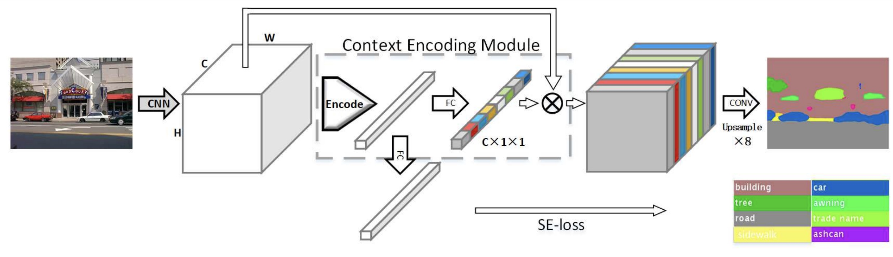

### [DenseASPP for Semantic Segmentation in Street Scenes](https://openaccess.thecvf.com/content_cvpr_2018/papers/Yang_DenseASPP_for_Semantic_CVPR_2018_paper.pdf) (CVPR'18)
#### <strong>overview</strong>
***
#### <strong>issue</strong>
***
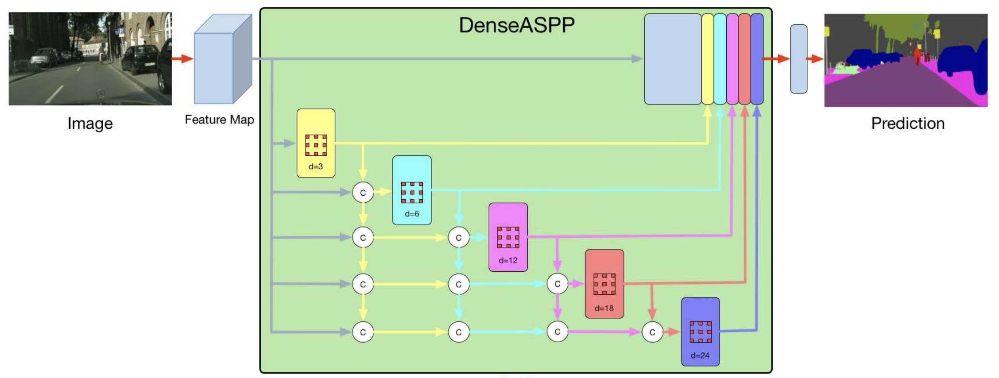

### [OCNet: Object Context Network for Scene Parsing](https://arxiv.org/abs/1809.00916) (arxiv'18)
#### <strong>overview</strong>
***
#### <strong>issue</strong>
***
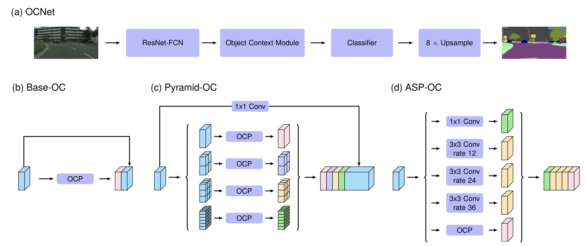

### [PSANet: Point-wise Spatial Attention Network for Scene Parsing](https://hszhao.github.io/papers/eccv18_psanet.pdf) (ECCV'18)
#### <strong>overview</strong>
***
#### <strong>issue</strong>
***
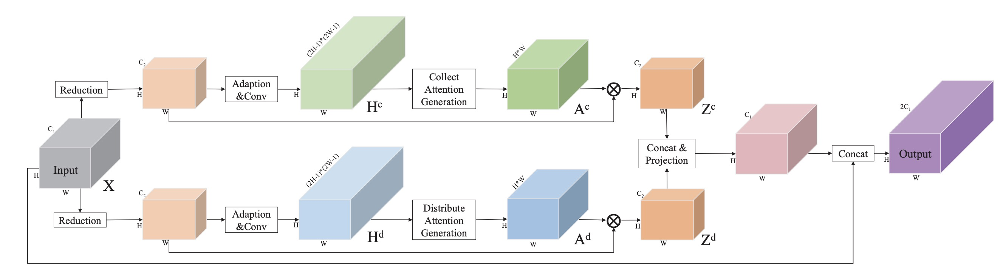
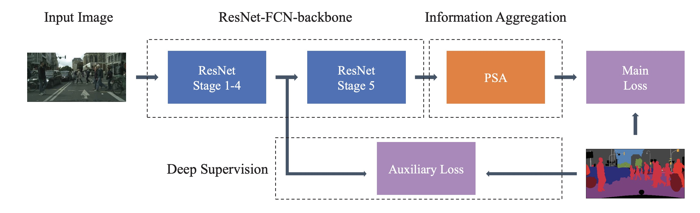

### [Encoder-Decoder with Atrous Separable Convolution for Semantic Image Segmentation(DeepLabv3+)](https://arxiv.org/abs/1802.02611) (ECCV'18)
#### <strong>overview</strong>
***
#### <strong>issue</strong>
***
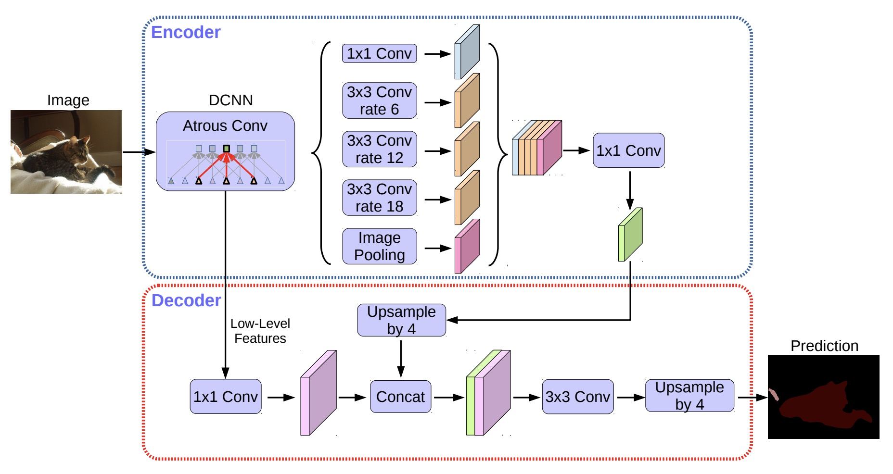

### [ExFuse: Enhancing Feature Fusion for Semantic Segmentation](https://openaccess.thecvf.com/content_ECCV_2018/papers/Zhenli_Zhang_ExFuse_Enhancing_Feature_ECCV_2018_paper.pdf) (ECCV'18)
#### <strong>overview</strong>
***
#### <strong>issue</strong>
***
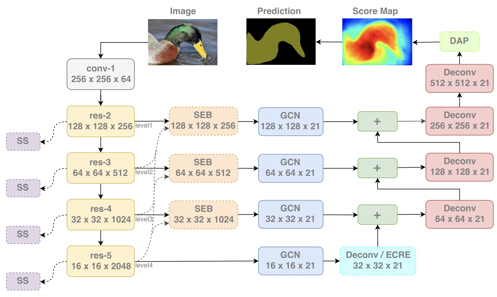

### [Pyramid Attention Network for Semantic Segmentation](http://bmvc2018.org/contents/papers/1120.pdf) (BMVC'18)
#### <strong>overview</strong>
***
#### <strong>issue</strong>
***
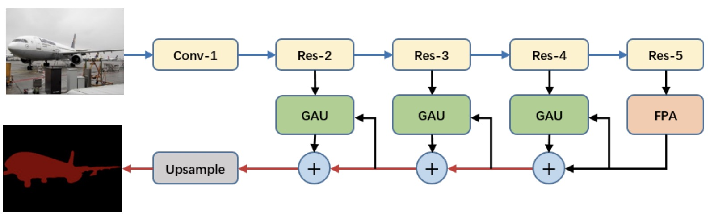
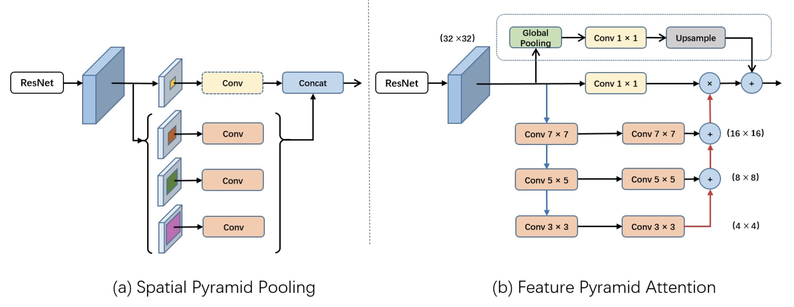

### [Concurrent Spatial and Channel Squeeze & Excitation in Fully Convolutional Networks](https://arxiv.org/abs/1803.02579) (MICCAI'18)
#### <strong>overview</strong>
***
#### <strong>issue</strong>
***
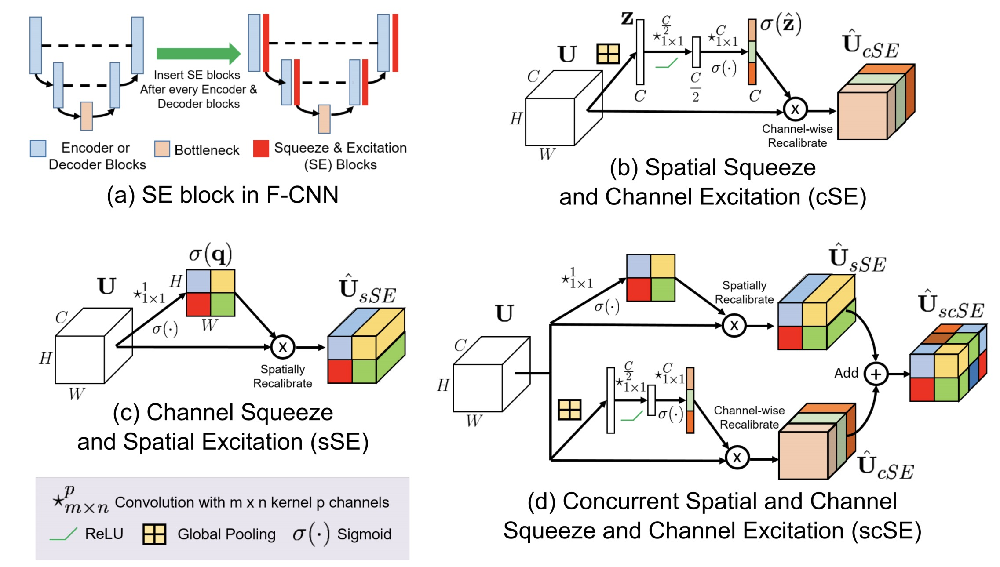

## 2019

### [Decoders Matter for Semantic Segmentation: Data-Dependent Decoding Enables Flexible Feature Aggregation](https://openaccess.thecvf.com/content_CVPR_2019/papers/Tian_Decoders_Matter_for_Semantic_Segmentation_Data-Dependent_Decoding_Enables_Flexible_Feature_CVPR_2019_paper.pdf) (CVPR"19)
#### <strong>overview</strong>
***
#### <strong>issue</strong>
***
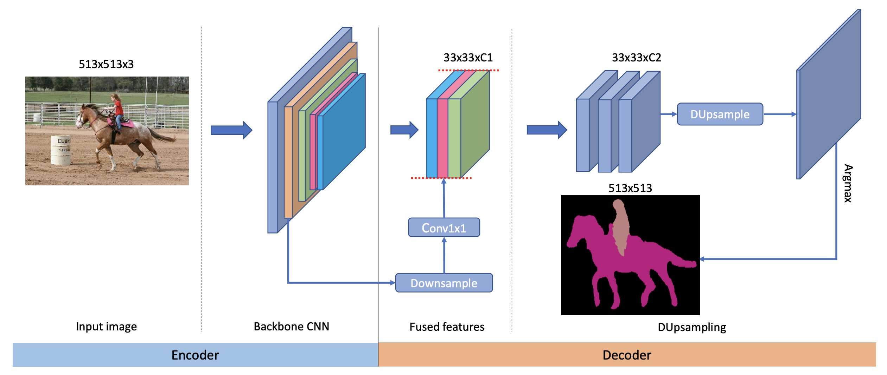
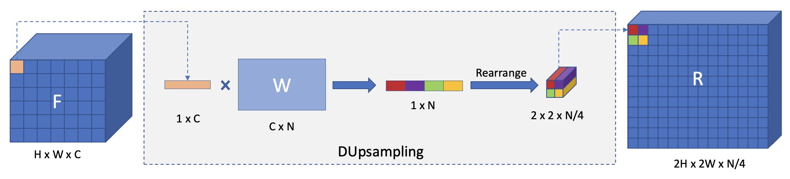

### [Deep High-Resolution Representation Learning for Visual Recognition(HRNet)](https://arxiv.org/abs/1908.07919) (TPAMI'19)
#### <strong>overview</strong>
***
#### <strong>issue</strong>
***
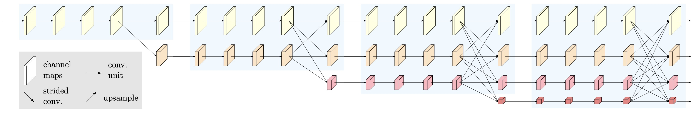

### [Dual Attention Network for Scene Segmentation](https://arxiv.org/abs/1809.02983) (CVPR'19)
#### <strong>overview</strong>
***
#### <strong>issue</strong>
***
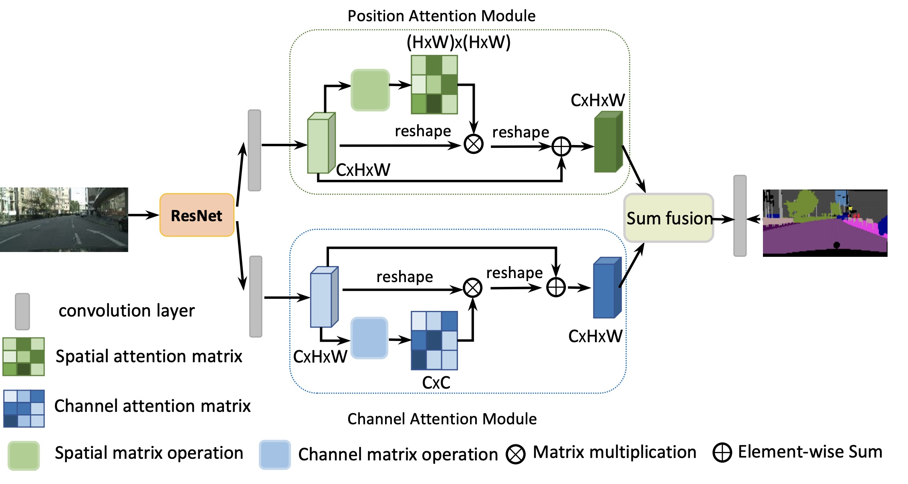

### [Auto-DeepLab: Hierarchical Neural Architecture Search for Semantic Image Segmentation](https://openaccess.thecvf.com/content_CVPR_2019/papers/Liu_Auto-DeepLab_Hierarchical_Neural_Architecture_Search_for_Semantic_Image_Segmentation_CVPR_2019_paper.pdf) (CVPR'19)
#### <strong>overview</strong>
***
#### <strong>issue</strong>
***
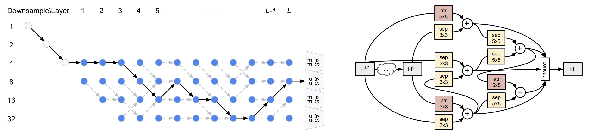

### [Co-occurrent Features in Semantic Segmentation](https://openaccess.thecvf.com/content_CVPR_2019/papers/Zhang_Co-Occurrent_Features_in_Semantic_Segmentation_CVPR_2019_paper.pdf) (CVPR'19)
#### <strong>overview</strong>
***
#### <strong>issue</strong>
***
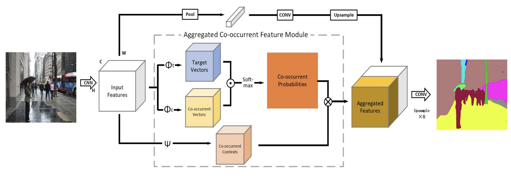

### [Asymmetric Non-local Neural Networks for Semantic Segmentation](https://openaccess.thecvf.com/content_ICCV_2019/papers/Zhu_Asymmetric_Non-Local_Neural_Networks_for_Semantic_Segmentation_ICCV_2019_paper.pdf) (ICCV'19)
#### <strong>overview</strong>
***
#### <strong>issue</strong>
***
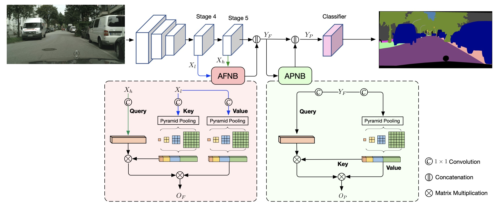

### [Expectation-Maximization Attention Networks for Semantic Segmentation](https://arxiv.org/abs/1907.13426) (ICCV'19)
#### <strong>overview</strong>
***
#### <strong>issue</strong>
***
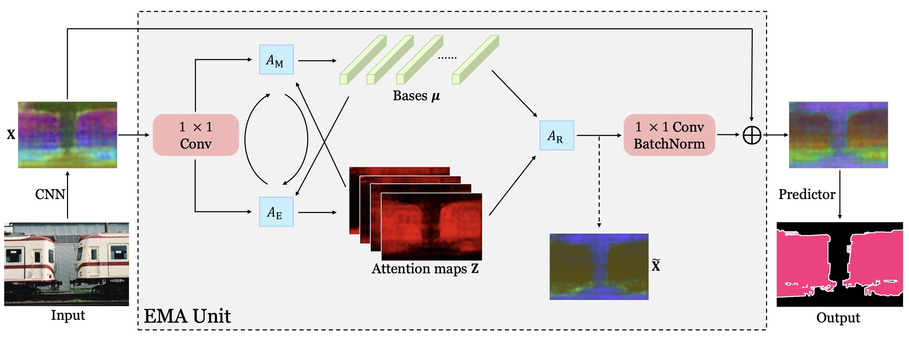

### [Gated-SCNN: Gated Shape CNNs for Semantic Segmentation](https://arxiv.org/abs/1907.05740) (ICCV'19)
#### <strong>overview</strong>
***
#### <strong>issue</strong>
***
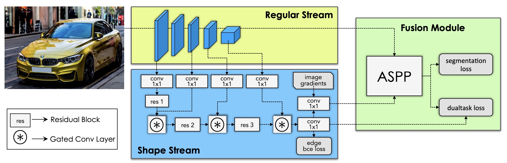

### [FastFCN: Rethinking Dilated Convolution in the Backbone for Semantic Segmentation](https://arxiv.org/abs/1903.11816) (arxiv'19)
#### <strong>overview</strong>
***
#### <strong>issue</strong>
***
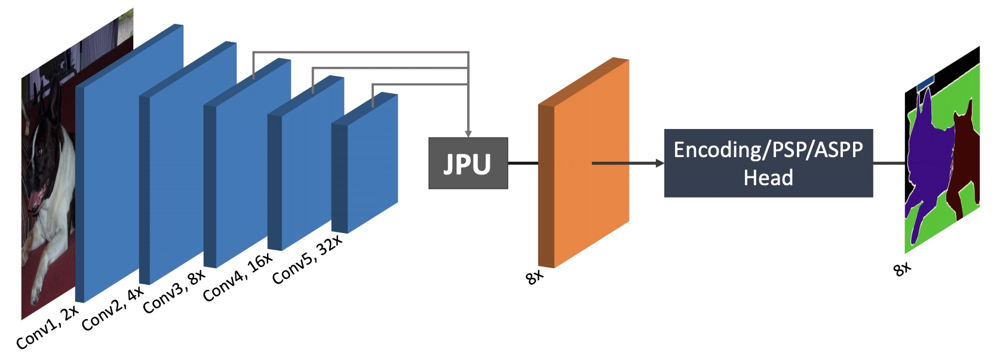
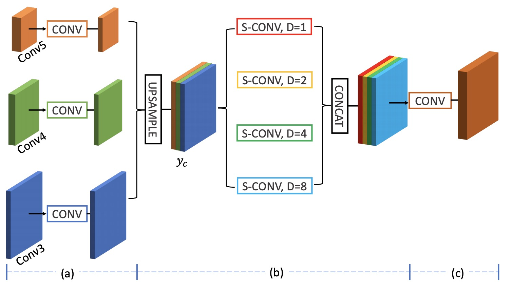

### [Convolutional CRFs for Semantic Segmentation](https://bmvc2019.org/wp-content/uploads/papers/0865-paper.pdf) (BMVC'19)
#### <strong>overview</strong>
***
#### <strong>issue</strong>
***

## 2020

### [Cars Can’t Fly up in the Sky: Improving Urban-Scene Segmentation via Height-driven Attention Networks](https://arxiv.org/abs/2003.05128v3) (CVPR'20)
#### <strong>overview</strong>
***
#### <strong>issue</strong>
***
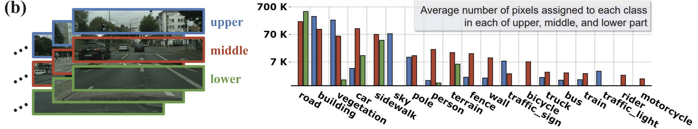
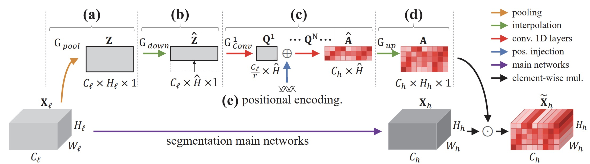

### [Learning Dynamic Routing for Semantic Segmentation](https://openaccess.thecvf.com/content_CVPR_2020/papers/Li_Learning_Dynamic_Routing_for_Semantic_Segmentation_CVPR_2020_paper.pdf) (CVPR'20)
#### <strong>overview</strong>
***
#### <strong>issue</strong>
***
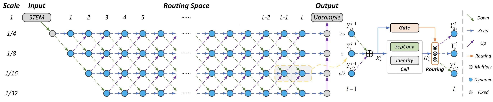
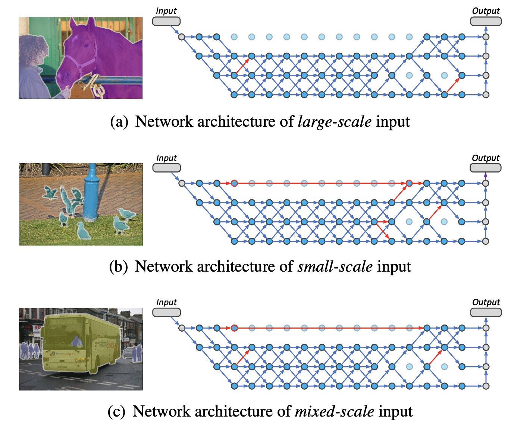

### [CascadePSP: Toward Class-Agnostic and Very High-Resolution Segmentation via Global and Local Refinement](https://openaccess.thecvf.com/content_CVPR_2020/papers/Cheng_CascadePSP_Toward_Class-Agnostic_and_Very_High-Resolution_Segmentation_via_Global_and_CVPR_2020_paper.pdf) (CVPR'20)
#### <strong>overview</strong>
***
#### <strong>issue</strong>
***
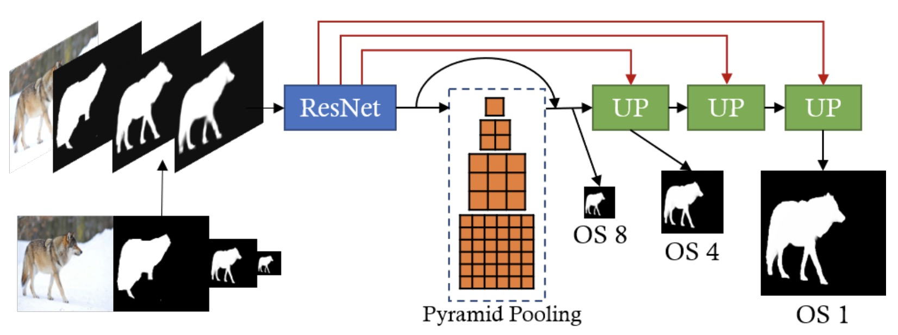

### [PointRend: Image Segmentation as Rendering](https://openaccess.thecvf.com/content_CVPR_2020/papers/Kirillov_PointRend_Image_Segmentation_As_Rendering_CVPR_2020_paper.pdf) (CVPR'20)
#### <strong>overview</strong>
***
#### <strong>issue</strong>
***
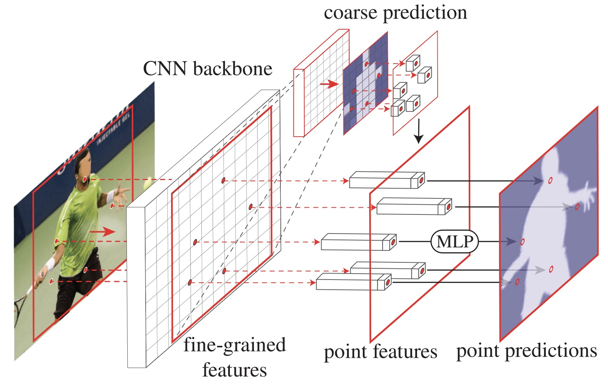

### [Squeeze-and-Attention Networks for Semantic Segmentation](https://openaccess.thecvf.com/content_CVPR_2020/papers/Zhong_Squeeze-and-Attention_Networks_for_Semantic_Segmentation_CVPR_2020_paper.pdf) (CVPR'20)
#### <strong>overview</strong>
***
#### <strong>issue</strong>
***
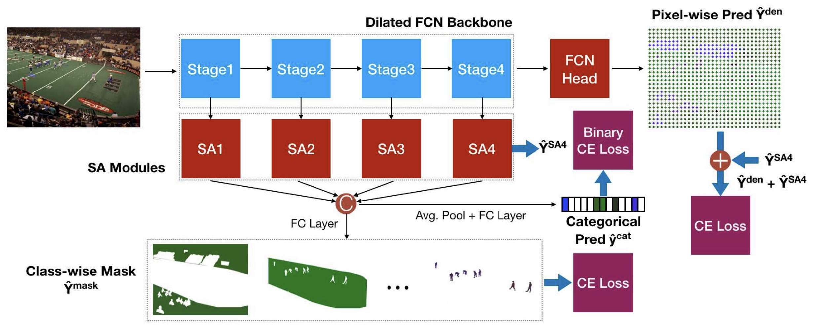
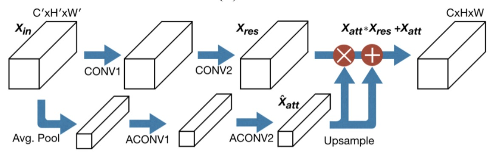

### [Context Prior for Scene Segmentation](https://openaccess.thecvf.com/content_CVPR_2020/papers/Yu_Context_Prior_for_Scene_Segmentation_CVPR_2020_paper.pdf) (CVPR'20)
#### <strong>overview</strong>
***
#### <strong>issue</strong>
***
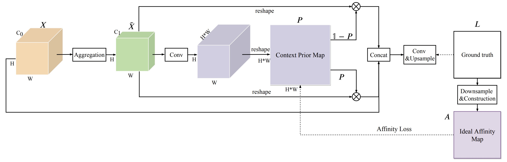

### [Learning to Predict Context-adaptive Convolution for Semantic Segmentation](https://arxiv.org/abs/2004.08222) (ECCV'20)
#### <strong>overview</strong>
***
#### <strong>issue</strong>
***
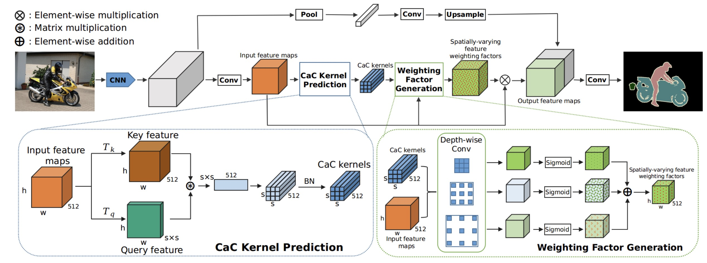
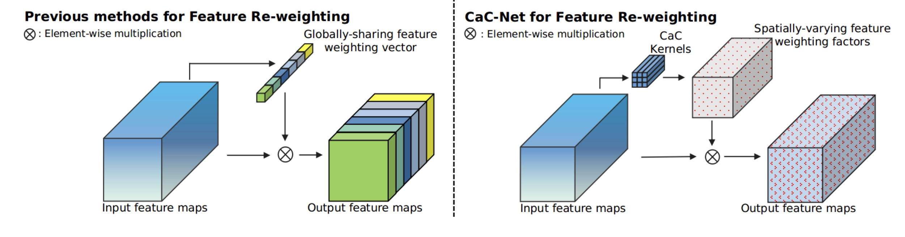

### [Object-Contextual Representations for Semantic Segmentation](https://arxiv.org/abs/1909.11065) (ECCV'20)
#### <strong>overview</strong>
***
#### <strong>issue</strong>
***
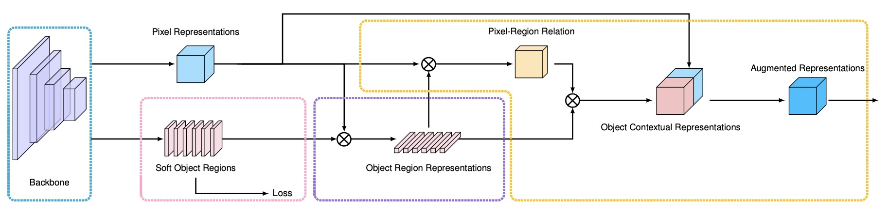

### [SegFix: Model-Agnostic Boundary Refinement for Segmentation](https://arxiv.org/abs/2007.04269) (ECCV'20)
#### <strong>overview</strong>
***
#### <strong>issue</strong>
***

### [Semantic Flow for Fast and Accurate Scene Parsing](https://arxiv.org/abs/2002.10120) (ECCV'20)
#### <strong>overview</strong>
***
#### <strong>issue</strong>
***
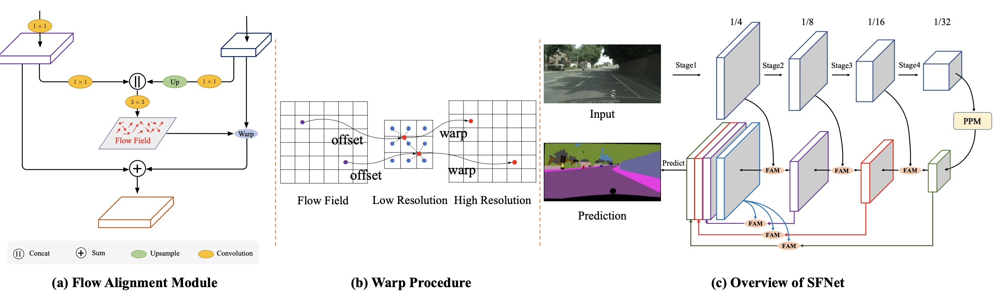

### [Hierarchical Multi-Scale Attention for Semantic Segmentation](https://arxiv.org/abs/2005.10821) (arxiv'20)
#### <strong>overview</strong>
***
#### <strong>issue</strong>
***
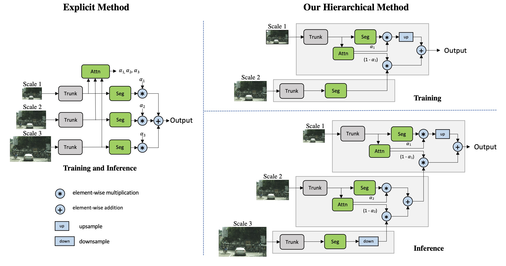

### [Rethinking Pre-training and Self-training](https://arxiv.org/abs/2006.06882v1) (arxiv'20)
#### <strong>overview</strong>
***
#### <strong>issue</strong>
***

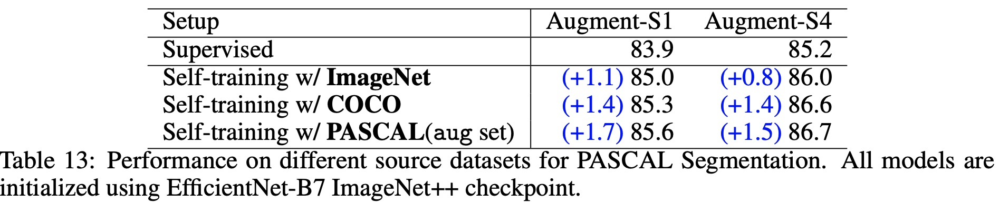

# real time semantic segmentation

### [ESPNet: Efficient Spatial Pyramid of Dilated Convolutions for Semantic Segmentation](https://openaccess.thecvf.com/content_ECCV_2018/papers/Sachin_Mehta_ESPNet_Efficient_Spatial_ECCV_2018_paper.pdf) (ECCV'18)
#### <strong>overview</strong>
***
#### <strong>issue</strong>
***

### [ICNet for Real-Time Semantic Segmentation on High-Resolution Images](https://openaccess.thecvf.com/content_ECCV_2018/papers/Hengshuang_Zhao_ICNet_for_Real-Time_ECCV_2018_paper.pdf) (ECCV'18)
#### <strong>overview</strong>
***
#### <strong>issue</strong>
***

### [ContextNet: Exploring Context and Detail for Semantic Segmentation in Real-time](http://bmvc2018.org/contents/papers/0286.pdf) (BMVC'18)
#### <strong>overview</strong>
***
#### <strong>issue</strong>
***
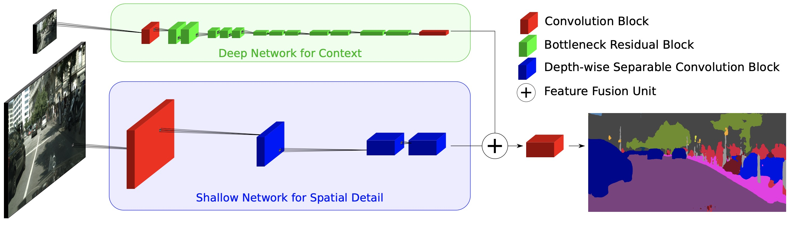

### [FASTERSEG: SEARCHING FOR FASTER REAL-TIME SEMANTIC SEGMENTATION](https://openreview.net/pdf?id=BJgqQ6NYvB) (ICLR'20)
#### <strong>overview</strong>
***
#### <strong>issue</strong>
***
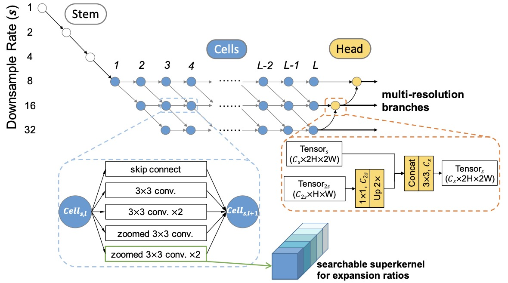
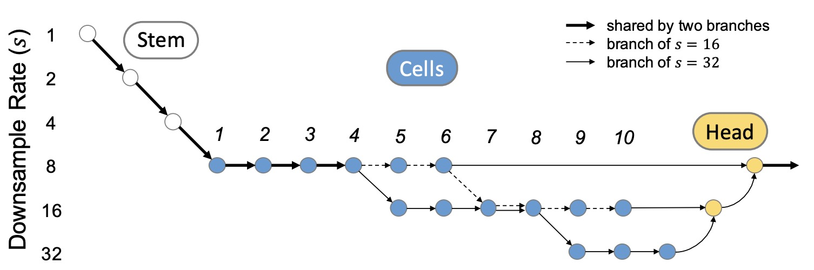

# loss function

### Binary_Cross_Entropy
### Weighted_Cross_Entropy
### Focal Loss
### Dice Loss
### Combo Loss
### lovasz hinge

# Competition overview / Top solution
##  [Understanding Clouds from Satellite Images](https://www.kaggle.com/c/understanding_cloud_organization)
### Overview

### Top solutions

#### 1st place

#### 2nd place

#### 3rd place

## [SIIM-ACR Pneumothorax Segmentation](https://www.kaggle.com/c/siim-acr-pneumothorax-segmentation)
### Overview

### Top solutions

#### 1st place

#### 2nd place

#### 3rd place

## [TGS Salt Identification Challenge](https://www.kaggle.com/c/tgs-salt-identification-challenge)
### Overview

### Top solutions

#### 1st place

#### 2nd place

#### 3rd place

