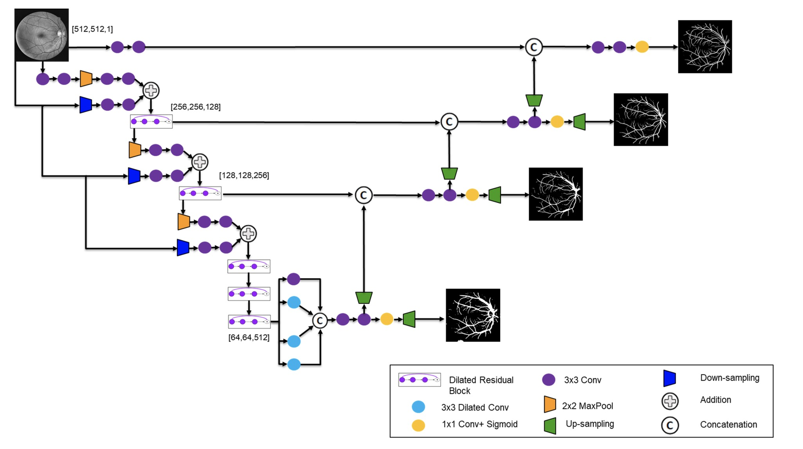

# semantic segmentaiton

- [model architecture](#model_architecture)
  - [2014](#2014)
    - [SDS](#sds) (ECCV'14)
  - [2015](#2015)
    - [FCN](#fcn) (CVPR'15)
    - [Hypercolumns](#hypercolumns) (CVPR'15)
    - [DeonvNet](#deconvnet) (ICCV'15)
    - [segnet](#segnet) (arxiv'15)
    - [DeepLab](#deeplab) (ICLR'15)
    - [U-Net](#unet) (MICCAI'15)
  - [2016](#2016)
    - [dilatednet](#dilatednet) (ICLR'16)
    - [parsenet](#parsenet) (arxiv'16)
    - [DeepLabv2](#deeplabv2) (arxiv'16)
  - [2017](#2017)
    - [GCN](#gcn) (CVPR'17)
    - [PSPNet](#pspnet) (CVPR'17)
    - [RefineNet](#refinenet) (CVPR'17)
    - [DeepLabv3](#deeplabv3) (arxiv'17)
  - [2018](#2018)
    - [EncNet](#encnet) (CVPR'18)
    - [DenseASPP](#denseaspp) (CVPR'18)
    - [OCNet](#ocnet) (arxiv'18)
    - [PSANet](#psanet) (ECCV'18)
    - [ESPNet](#espnet) (ECCV'18)
    - [ICNet](#icnet) (ECCV'18)
    - [ExFuse](#exfuse) (ECCV'18)
    - [PANet](#panet) (BMVC'18)
    - [SCSE](#scse) (MICCAI'18)
    - [attention unet](#attention_unet) (MIDL'18)
  - [2019](#2019)
    - [sparse self-attention](#sparse_self_attention) (arxiv'19)
    - [Decoders Matter for Semantic Segmentation](#decoder_matters) (CVPR'19)
    - [HRNet](#hrnet) (CVPR'19)
    - [Feature Pyramid Networks](#fpn) (CVPR'19)
    - [auto-DeepLab](#auto_deeplab) (CVPR'19)
    - [ACFNet](#acfnet) (ICCV'19)
    - [assymetric nonlocal NN](#assymetrci_nonlocal_nn) (ICCV'19)
    - [EMANet](#emanet) (ICCV'19)
    - [gated scnn](#gated_scnn) (ICCV'19)
    - [FastFCN](#fastfcn) (arxiv'19)
    - [convCRF](#convcrf) (BMVC'19)
  - [2020](#2020)
    - [dynamic routing](#) (CVPR'20)
    - [cascade PSP](#cascade_psp) (CVPR'20)
    - [pointrend](#pointrend) (CVPR'20)
    - [distanced channel weight](#distanced_channel_weight) (CVPR'20)
    - [SANet](#SANet) (CVPR'20)
    - [context prior](#context_prior) (CVPR'20)
    - [context adaptive convolution](#context_adaptive_convolution) (ECCV'20)
    - [OCR](#ocr) (ECCV'20)
    - [SegFix](#segfix) (ECCV'20)
    - [Semantic Flow](#semantic_flow) (ECCV'20)
  - [categorize all models](#categorize)
    
- [real time semantic segmentation model](#)
  - [ContextNet](#contextnet) (BMVC'18)
  - [FASTERSEG](#fasterseg) (ICLR'20)

- [loss function](#loss_function)
  - [Binary_Cross Entropy](#binary_cross_entropy) 
  - [Weighted Cross Entropy](#weighted_cross_entropy)
  - [Focal Loss](#focal_loss)
  - [Dice Loss](#dice_loss)
  - [Combo Loss](#combo_loss)
  - [lovasz hinge](#lovasz_hinge)

- [competition overview / top solution](#competition)

- [how to win segmentation competition](#how_to_win_segmentation_competition)

# model architecture

## 2015

### [Fully Convolutional Networks for Semantic Segmentation](https://arxiv.org/abs/1411.4038) (CVPR'15)
#### <strong>overview</strong>
***
- FCN transfer classification model by substituting fully connected layrs with 1x1 convolution
- As the model produces coarse output locations(conv7 output), output feature-map is upsampled 32x by bilinear interpolation(FCN-32s). 
- But this up-sampled feature-map is not enough for finegrained segmentation, so the authors use skip connection to combine conv7 output and lower layers output(conv4, conv3 output). 
- FCN-8s give the best result in PASCAL VOC 2011 & 2012 test data.
#### <strong>issue</strong>
***
- FCN use skip connections for finegrained segmentation, but it is not enough to represent detail information, especially object boudary.
- Detail information is usually missing due to the use of the down-sampling layers

 

### [Hypercolumns for Object Segmentation and Fine-grained Localization](https://arxiv.org/abs/1411.5752)  (CVPR'15)
#### <strong>overview</strong>
- Hypercolumn stack deep and shallow layer output of CNN into one vector
- Deep layer capture semantics, while shallow layer is precise in localization
- So we can do more precise segmentation by using Hypercolumn
- it improves SDS from 49.7 to 52.8 mean APr
***
#### <strong>issue</strong>
***
- same as FCN

　

### [Learning Deconvolution Network for Semantic Segmentation (DeconvNet)](https://arxiv.org/abs/1505.04366) (ICCV'15)
#### <strong>overview</strong>
***
- Convolutional network followed by hierarchically opposite deconvolutional network
- Convolutional network composed of 13 convolutional layers and 2 fully connected layers of VGG16 except the final classification layer
- Deconvolutional network is composed of deconvolution and unpooling layers
- Unpooling use max_pooling indices which is the locations of maximum activations during pooling operation in convolutional network. it can reconstruct detail image information.
- Deconvolution densify sparse unpooled feature maps using multiple learned filters by associating single input activation with multiple outputs
- Unlike FCN, trained model is applied to each proposal in an input image, and construct the final segmentation result by combining the result from all proposals
- mean IoU is 72.5% in PASCAL VOC 2012, it is superior than FCN-8s(62.2%)
- As a result, deconvolutional network can reconstruct detail information
#### <strong>issue</strong>
***
- Model is huge and slow
- Using max_pooling indices is not enough to reconstruct detail information

### [SegNet: A Deep Convolutional Encoder-Decoder Architecture for Image Segmentation](https://arxiv.org/abs/1511.00561) (arxiv'15)
#### <strong>overview</strong>
***
- Most of the model architecture is same as DeconvNet
- Difference of DeconvNet is removing 2 fully connected layers, which decrease model size from 134M to 14.7M

### [SEMANTIC IMAGE SEGMENTATION WITH DEEP CONVOLUTIONAL NETS AND FULLY CONNECTED CRFS(DeepLab)](https://arxiv.org/abs/1412.7062) (ICLR'15)
#### <strong>overview</strong>
***
- This paper propose atrous convolution which sparsely sample feature map
- Architecture of DeepLab is VGG16 removing pool4 and pool5, which can keep high resolution, but recdptive field is reduced
- By substituting some last convolutions by atrous convolution, DeepLab can keep receptive field
- Use CRF to capture fine details for postprocess
- Use multi scale prediction for better boudary localization
#### <strong>issue</strong>
***
- By removing pool4 and pool5, feature map keep high resolution
- it increase flops

 

### [U-Net: Convolutional Networks for Biomedical Image Segmentation](https://arxiv.org/abs/1505.04597) (MICCAI'15)
#### <strong>overview</strong>
***
- Use encoder featuremap in decoder network
- Decoder network concatenate output of deep layer and corresponding output of shallow layer
- It can use more precise information compared to segnet and deconvnet

  

## 2016

### [Deep Dilated Convolutional Nets for the Automatic Segmentation of Retinal Vessels](https://arxiv.org/abs/1905.12120) (ICLR'16)
#### <strong>overview</strong>
***
#### <strong>issue</strong>
***

### [ParseNet: Looking Wider to See Better](https://arxiv.org/abs/1506.04579) (arxiv'16)
#### <strong>overview</strong>
***
#### <strong>issue</strong>
***

### [DeepLab: Semantic Image Segmentation with Deep Convolutional Nets, Atrous Convolution, and Fully Connected CRFs(DeepLabv2)](https://arxiv.org/abs/1606.00915) (arxiv'16)
#### <strong>overview</strong>
***
#### <strong>issue</strong>
***

## 2017

###  ()
#### <strong>overview</strong>
***
#### <strong>issue</strong>
***

###  ()
#### <strong>overview</strong>
***
#### <strong>issue</strong>
***

###  ()
#### <strong>overview</strong>
***
#### <strong>issue</strong>
***

###  ()
#### <strong>overview</strong>
***
#### <strong>issue</strong>
***

###  ()
#### <strong>overview</strong>
***
#### <strong>issue</strong>
***

###  ()
#### <strong>overview</strong>
***
#### <strong>issue</strong>
***

###  ()
#### <strong>overview</strong>
***
#### <strong>issue</strong>
***

###  ()
#### <strong>overview</strong>
***
#### <strong>issue</strong>
***

###  ()
#### <strong>overview</strong>
***
#### <strong>issue</strong>
***

###  ()
#### <strong>overview</strong>
***
#### <strong>issue</strong>
***

###  ()
#### <strong>overview</strong>
***
#### <strong>issue</strong>
***

###  ()
#### <strong>overview</strong>
***
#### <strong>issue</strong>
***

###  ()
#### <strong>overview</strong>
***
#### <strong>issue</strong>
***

###  ()
#### <strong>overview</strong>
***
#### <strong>issue</strong>
***

###  ()
#### <strong>overview</strong>
***
#### <strong>issue</strong>
***

###  ()
#### <strong>overview</strong>
***
#### <strong>issue</strong>
***

###  ()
#### <strong>overview</strong>
***
#### <strong>issue</strong>
***

###  ()
#### <strong>overview</strong>
***
#### <strong>issue</strong>
***

###  ()
#### <strong>overview</strong>
***
#### <strong>issue</strong>
***

###  ()
#### <strong>overview</strong>
***
#### <strong>issue</strong>
***

###  ()
#### <strong>overview</strong>
***
#### <strong>issue</strong>
***

###  ()
#### <strong>overview</strong>
***
#### <strong>issue</strong>
***

###  ()
#### <strong>overview</strong>
***
#### <strong>issue</strong>
***

###  ()
#### <strong>overview</strong>
***
#### <strong>issue</strong>
***

###  ()
#### <strong>overview</strong>
***
#### <strong>issue</strong>
***

###  ()
#### <strong>overview</strong>
***
#### <strong>issue</strong>
***

###  ()
#### <strong>overview</strong>
***
#### <strong>issue</strong>
***

###  ()
#### <strong>overview</strong>
***
#### <strong>issue</strong>
***

###  ()
#### <strong>overview</strong>
***
#### <strong>issue</strong>
***

###  ()
#### <strong>overview</strong>
***
#### <strong>issue</strong>
***

###  ()
#### <strong>overview</strong>
***
#### <strong>issue</strong>
***

###  ()
#### <strong>overview</strong>
***
#### <strong>issue</strong>
***

###  ()
#### <strong>overview</strong>
***
#### <strong>issue</strong>
***

###  ()
#### <strong>overview</strong>
***
#### <strong>issue</strong>
***

###  ()
#### <strong>overview</strong>
***
#### <strong>issue</strong>
***

###  ()
#### <strong>overview</strong>
***
#### <strong>issue</strong>
***

###  ()
#### <strong>overview</strong>
***
#### <strong>issue</strong>
***

###  ()
#### <strong>overview</strong>
***
#### <strong>issue</strong>
***

###  ()
#### <strong>overview</strong>
***
#### <strong>issue</strong>
***

###  ()
#### <strong>overview</strong>
***
#### <strong>issue</strong>
***

###  ()
#### <strong>overview</strong>
***
#### <strong>issue</strong>
***

###  ()
#### <strong>overview</strong>
***
#### <strong>issue</strong>
***

###  ()
#### <strong>overview</strong>
***
#### <strong>issue</strong>
***

###  ()
#### <strong>overview</strong>
***
#### <strong>issue</strong>
***

###  ()
#### <strong>overview</strong>
***
#### <strong>issue</strong>
***

###  ()
#### <strong>overview</strong>
***
#### <strong>issue</strong>
***

###  ()
#### <strong>overview</strong>
***
#### <strong>issue</strong>
***

###  ()
#### <strong>overview</strong>
***
#### <strong>issue</strong>
***

###  ()
#### <strong>overview</strong>
***
#### <strong>issue</strong>
***

###  ()
#### <strong>overview</strong>
***
#### <strong>issue</strong>
***

###  ()
#### <strong>overview</strong>
***
#### <strong>issue</strong>
***

###  ()
#### <strong>overview</strong>
***
#### <strong>issue</strong>
***

###  ()
#### <strong>overview</strong>
***
#### <strong>issue</strong>
***

###  ()
#### <strong>overview</strong>
***
#### <strong>issue</strong>
***

###  ()
#### <strong>overview</strong>
***
#### <strong>issue</strong>
***

###  ()
#### <strong>overview</strong>
***
#### <strong>issue</strong>
***

###  ()
#### <strong>overview</strong>
***
#### <strong>issue</strong>
***

###  ()
#### <strong>overview</strong>
***
#### <strong>issue</strong>
***

###  ()
#### <strong>overview</strong>
***
#### <strong>issue</strong>
***

###  ()
#### <strong>overview</strong>
***
#### <strong>issue</strong>
***

###  ()
#### <strong>overview</strong>
***
#### <strong>issue</strong>
***

